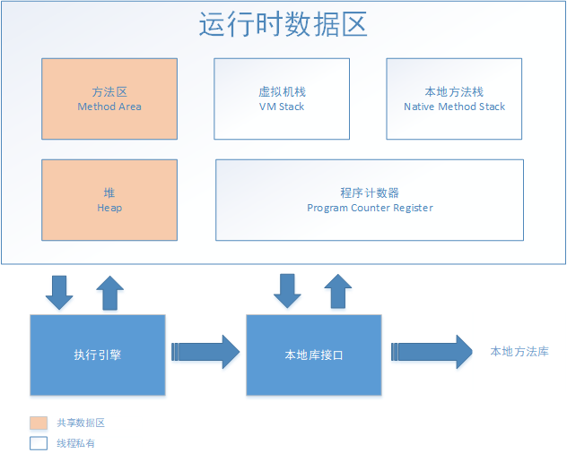

## 运行时数据区域
 

 + 程序计数器  
    当前线程所执行的字节码的行号指示器  
    线程私有，各条线程之间计数器互不影响，独立存储  
    唯一没有规定OutOfMemory情况的区域
 + 虚拟机栈  
    线程私有，生命周期与线程相同  
    栈帧：方法执行时创建的内存模型，存储局部变量表、操作数栈、动态链接、方法出口等信息  
    异常：StackOverflowError、OutOfMemoryError    
 + 本地方法栈  
    线程私有，为虚拟机使用到的Native方法服务  
    异常：StackOverflowError、OutOfMemoryError  
 + Java堆（GC堆）  
    所有线程共享的内存区域，在虚拟机启动时创建  
	用于存放几乎所有的对象实例，是垃圾收集器管理的主要区域  
    分类：新生代和老年代  
    TLAB（Thread Local Allocation Buffer）：线程私有的分配缓冲区  
    异常：OutOfMemoryError  
 + 方法区  
    所有线程共享的内存区域  
    存储已被虚拟机加载的类信息、常量、静态变量、即时编译器编译后的代码等数据  
    异常：OutOfMemoryError  
 + 运行时常量池  
    属于方法区的一部分  
    (1)用于存储Class文件中的常量池信息，即编译期生成的各种字面量和符号引用  
    (2)除了符号引用外，还会存储翻译出的直接引用  
    (3)具备动态性，在运行期间会将新的常量放入  
 + 直接内存  
    堆外内存，然后通过存储在Java堆中的DirectByteBuffer对象作为内存的引用进行操作  
    分配不受Java堆大小限制，受本机总内存大小及处理器寻址空间限制  
    异常：OutOfMemoryError  
