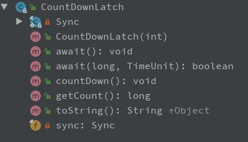
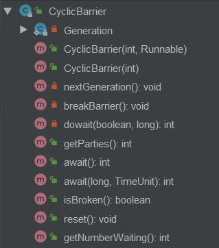
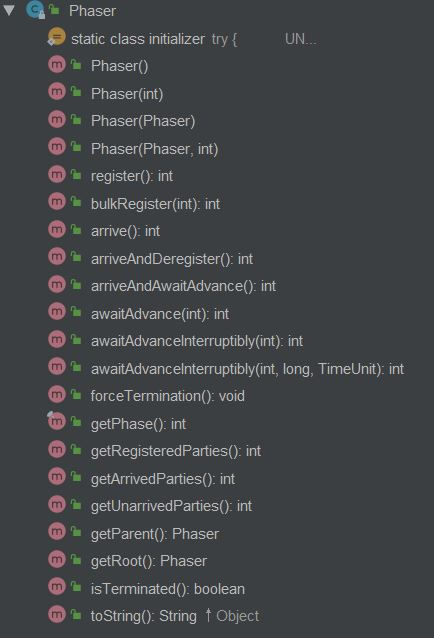

# 线程同步API

+ `Semaphore`：限制线程并发的数量
+ `Exchanger`：两个线程之间传输数据
+ `CountDownLatch`：控制线程执行任务的时机，使线程以“组团”的方式一起执行任务
+ `CyclicBarrier`：控制线程执行任务的时机，实现屏障等待(阶段性同步)的功能
+ `Phaser`：动态添加parties计数  

## 1. Semaphore
Semaphore内部包含一个继承了`AbstractQueuedSynchronizer`的同步器抽象类`Sync`，具体实现为`FairSync`公平同步器和`NonfairSync`非公平同步器。同步器均实现了共享式获取锁方法`tryAcquireShared(int acquires)`和共享式释放锁方法`tryReleaseShared(int releases)`。


### 1.1 Semaphore构造方法permits参数
参数`permits`的作用是设置许可的个数:  
  ```java
    // 设置permits为2
    private Semaphore semaphore = new Semaphore(2);
  ```
> 通过对类Semaphore的构造方法传递参数permits值如果大于1时，无法保证线程安全性，因为可能出现多个线程共同访问实例变量，导致出现脏数据的情况。  

### 1.2 常用方法
+ `void acquire()`：每次调用仅获取1个许可
+ `void acquire(int permits)`：每次调用使用x个许可  
+ `void acquireUninterruptibly()`/`void acquireUninterruptibly(int permits)`：在等待许可的情况下不允许被中断，如果成功获得锁，则取得指定的permits许可个数。  
+ `int availablePermits()`：返回Semaphore对象中当前可用的许可数
+ `int drainPermits()`：获取并返回立即可用的所有许可数，并且将可用许可置为0  
+ `int getQueueLength()`：取得等待许可的线程个数
+ `boolean hasQueuedThreads()`：判断有没有线程在等待许可
+ `boolean tryAcquire()`/`boolean tryAcquire(int permits)`：尝试获取1个/permits个许可，如果获取不到则返回false，具有无阻塞的特点
+ `boolean tryAcquire(long timeout, TimeUnit unit)`/`boolean tryAcquire(int permits, long timeout, TimeUnit unit)`：在指定的时间内尝试地获取1个/permits个许可，如果获取不到则返回false
+ ``

> 如果多次调用Semaphore类的`release()`或`release(int permits)`方法时，可以动态增加permits的个数。  

## 2. Exchanger
类Exchanger使两个线程之间传输数据，比生产者/消费者模式使用的`wait/notify`更加方便。Exchanger类的主要方法是`exchange()`。  

+ `V exchange(V x)`：一直阻塞
+ `V exchange(V x, long timeout, TimeUnit unit)`：阻塞超时  

## 3. CountDownLatch
类CountDownLatch判断count值是否为零：如果count计数不为0时则当前线程处于wait状态，即在屏障处等待；如果count计数为0时则继续运行。CountDownLatch作用：一个线程或者多个线程，等待另外一个线程或多个线程完成某个是心情后才能继续执行。  



CountDownLatch包含一个继承了`AbstractQueuedSynchronizer`的同步器，并重写了共享锁相关的`int tryAcquireShared(int acquires)`和`boolean tryReleaseShared(int releases)`方法。CountDownLatch类实现等待与继续运行的效果分为需要使用`await()`和`countDown()`方法来进行，`await()`方法在同步器的count值为零时获取到锁，`countDown()`方法减少同步器的count值直到0。  
> CountDownLatch的计数无法被重置，如果需要重置计数，可使用CyclicBarrier类。  

## 4. CyclicBarrier
类CyclicBarrier不仅有CountDownLatch所具有的功能，还可以实现屏障等待的功能(阶段性同步)，可以循环地实现线程要一起做任务的目标。  

  

CyclicBarrier允许一组线程互相等待，直到到达某个公共屏障点，这些线程必须实时的互相等待。CyclicBarrier类的公共屏障点可以重用。CyclicBarrier的作用：多个线程之间相互等待，任何一个线程完成之前，所有的线程都必须等待。  

类CyclicBarrier具有屏障重置性，可通过`getNumberWaiting()`获取有几个线程已经到达屏障点；可通过`getParties()`取得parties的个数；可通过`isBroken()`查询屏障是否处于损坏状态；可通过`reset()`重置屏障。  

## 5. Phaser

  

Phaser的计数操作是加法操作。  
+ `arriveAndAwaitAdvance()`：当前线程已经到达屏障，等待条件满足后继续向下一个屏障继续执行。  
+ 


