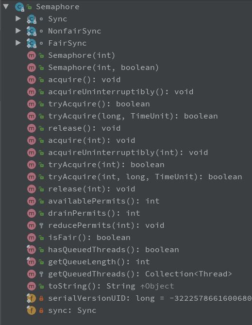

# 线程同步API

+ `Semaphore`：限制线程并发的数量
+ `Exchanger`：两个线程之间传输数据
+ `CountDownLatch`：控制线程执行任务的时机，使线程以“组团”的方式一起执行任务
+ `CyclicBarrier`：控制线程执行任务的时机，实现屏障等待(阶段性同步)的功能
+ `Phaser`：动态添加parties计数  

### 1. Semaphore
Semaphore内部包含一个继承了`AbstractQueuedSynchronizer`的同步器抽象类`Sync`，具体实现为`FairSync`公平同步器和`NonfairSync`非公平同步器。同步器均实现了共享式获取锁方法`tryAcquireShared(int acquires)`和共享式释放锁方法`tryReleaseShared(int releases)`。



#### 1.1 Semaphore构造方法permits参数
参数`permits`的作用是设置许可的个数:  
  ```java
    // 设置permits为2
    private Semaphore semaphore = new Semaphore(2);
  ```
> 通过对类Semaphore的构造方法传递参数permits值如果大于1时，无法保证线程安全性，因为可能出现多个线程共同访问实例变量，导致出现脏数据的情况。  

#### 1.2 常用方法
+ `void acquire()`：每次调用仅获取1个许可
+ `void acquire(int permits)`：每次调用使用x个许可  
+ `void acquireUninterruptibly()`/`void acquireUninterruptibly(int permits)`：在等待许可的情况下不允许被中断，如果成功获得锁，则取得指定的permits许可个数。  
+ `int availablePermits()`：返回Semaphore对象中当前可用的许可数
+ `int drainPermits()`：获取并返回立即可用的所有许可数，并且将可用许可置为0  


> 如果多次调用Semaphore类的`release()`或`release(int permits)`方法时，可以动态增加permits的个数。  


