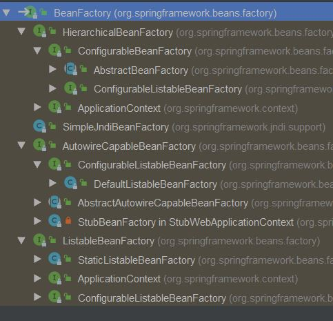

# Spring IoC容器

## 一、控制反转（依赖注入）
IoC容器是Spring实现**依赖反转**模式的载体，在对象生成或初始化时直接将数据注入到对象中，或通过将对象引用注入到对象数据域中的方式来注入对方法调用的依赖。这种依赖注入是可以递归的，对象被逐层注入。  
> Dependency injection (DI) is a process whereby objects define their dependencies (that is, the other objects with which they work) only through constructor arguments, arguments to a factory method, or properties that are set on the object instance after it is constructed or returned from a factory method. 


### Dependency Resolution Process
The container performs bean dependency resolution as follows:

+ The `ApplicationContext` is created and initialized with configuration metadata that describes all the beans. Configuration metadata can be specified by XML, Java code, or annotations.

+ For each bean, its dependencies are expressed in the form of properties, constructor arguments, or arguments to the static-factory method (if you use that instead of a normal constructor). These dependencies are provided to the bean, when the bean is actually created.

+ Each property or constructor argument is an actual definition of the value to set, or a reference to another bean in the container.

+ Each property or constructor argument that is a value is converted from its specified format to the actual type of that property or constructor argument. By default, Spring can convert a value supplied in string format to all built-in types, such as int, long, String, boolean, and so forth.

容器执行依赖项处理过程如下：  
+ 创建并使用定义bean的配置元数据来初始化`ApplicationContext`。可以使用XML、Java代码或注解添加配置元数据。  
+ 对于bean来说，可以使用属性、构造器参数或替代构造器的静态工厂方法参数来描述依赖项。容器会在bean实际创建时提供配置的依赖项。  
+ 每个属性或构造器参数要么是实际设置值的定义，要么是容器中其他bean的引用。  
+ 值类型的属性或构造器参数转换为实际需要的类型。默认地，Spring能够将设置的string类型值转换为所有的内置类型，如int、long、String、boolean等。  

## 依赖项和配置详情

### 简单属性（基本数据类型，String等）
### 引用其他bean
#### 配置属性
Specifying the target bean through the `parent` attribute creates a reference to a bean that is in a parent container of the current container. The value of the `parent` attribute may be the same as either the `id` attribute of the target bean or one of the values in the `name` attribute of the target bean. The target bean must be in a parent container of the current one. You should use this bean reference variant mainly when you have a hierarchy of containers and you want to wrap an existing bean in a parent container with a proxy that has the same name as the parent bean. The following pair of listings shows how to use the `parent` attribute:

通过`parent`属性指定目标bean会创建一个指向当前容器的父容器中bean的引用。`parent`属性的值应该与目标bean的`id`属性或`name`属性值一致。目标bean必须位于当前容器的父容器中。这种用法主要用于容器层级结构中通过代理的方式封装父容器bean，且与父容器中的bean名称相同。下面展示了如何使用`parent`属性：

```xml
<!-- in the parent context -->
<bean id="accountService" class="com.something.SimpleAccountService">
    <!-- insert dependencies as required as here -->
</bean>
```

```xml
<!-- in the child (descendant) context -->
<bean id="accountService" <!-- bean name is the same as the parent bean -->
    class="org.springframework.aop.framework.ProxyFactoryBean">
    <property name="target">
        <ref parent="accountService"/> <!-- notice how we refer to the parent bean -->
    </property>
    <!-- insert other configuration and dependencies as required here -->
</bean>
```

### Inner Bean
A `<bean/>` element inside the `<property/>` or `<constructor-arg/>` elements defines an inner bean, as the following example shows:  
`<property/>`或`<constructor-arg/>`元素中的`<bean/>`定义了一个内部bean，如下所示：  

```xml
<bean id="outer" class="...">
    <!-- instead of using a reference to a target bean, simply define the target bean inline -->
    <property name="target">
        <bean class="com.example.Person"> <!-- this is the inner bean -->
            <property name="name" value="Fiona Apple"/>
            <property name="age" value="25"/>
        </bean>
    </property>
</bean>
```
An inner bean definition does not require a defined ID or name. If specified, the container does not use such a value as an identifier. The container also ignores the `scope` flag on creation, because inner beans are always anonymous and are always created with the outer bean. It is not possible to access inner beans independently or to inject them into collaborating beans other than into the enclosing bean.   
内部bean定义不需要指定`ID`或`name`。即使指定该属性，容器不会将值作为bean的标识符。同时介于内部bean总是匿名且随着外部bean创建，容器在创建时会忽略内部bean的`scope`标志。内部bean无法单独使用或注入到除声明该bean的外部bean之外。

### 集合
The <list/>, <set/>, <map/>, and <props/> elements set the properties and arguments of the Java Collection types List, Set, Map, and Properties, respectively. The following example shows how to use them:  

`<list/>`、`<set/>`、`<map/>`和`<props/>`元素对应于设置java中集合类型`List`、`Set`、`Map`和`Properties`的属性和参数。例如： 

```xml
<bean id="moreComplexObject" class="example.ComplexObject">
    <!-- results in a setAdminEmails(java.util.Properties) call -->
    <property name="adminEmails">
        <props>
            <prop key="administrator">administrator@example.org</prop>
            <prop key="support">support@example.org</prop>
            <prop key="development">development@example.org</prop>
        </props>
    </property>
    <!-- results in a setSomeList(java.util.List) call -->
    <property name="someList">
        <list>
            <value>a list element followed by a reference</value>
            <ref bean="myDataSource" />
        </list>
    </property>
    <!-- results in a setSomeMap(java.util.Map) call -->
    <property name="someMap">
        <map>
            <entry key="an entry" value="just some string"/>
            <entry key ="a ref" value-ref="myDataSource"/>
        </map>
    </property>
    <!-- results in a setSomeSet(java.util.Set) call -->
    <property name="someSet">
        <set>
            <value>just some string</value>
            <ref bean="myDataSource" />
        </set>
    </property>
</bean>
```
集合合并必须在继承属性的子bean中指定`merge`属性，在父类容器中指定`merge`是多余的且不会生效。  

## 二、IoC容器
在Spring中IoC容器有两个主要的IoC容器系列：基于**BeanFactory接口**的简单容器系列和**ApplicationContext应用上下文**。  

**BeanDefinition**抽象了对Bean的定义，是让容器起作用的主要数据类型。对IoC容器来说，BeanDefinition是低依赖反转模式中管理的对象依赖关系的数据抽象，也是容器实现依赖反转功能的核心数据结构，依赖反转功能都是围绕对BeanDefinition的处理来完成的。  

### BeanFactory



