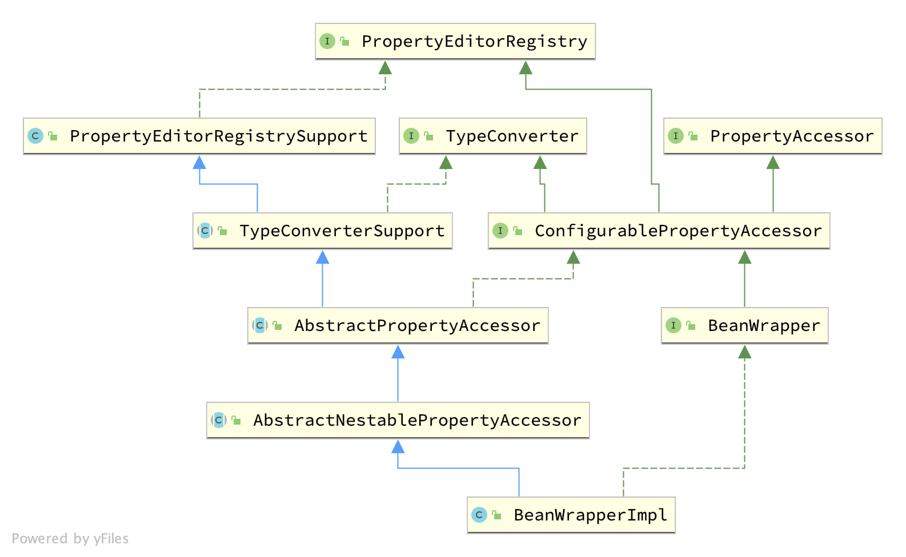

# 验证、数据绑定和类型转换
  验证逻辑应独立于web层，易于本地化且能够植入任何可用的验证器。基于上述观点，Spring提供了`Validator`约定以适用于应用的各个层面。  
数据绑定用于将用户输入动态地绑定到应用的领域模型(或任何用于处理用户输入的对象)。Spring为此提供了`DataBinder`类。`Validator`和`DataBinder`构成了`validation`包，该包主要用于但不限于web层。  
`BeanWrapper`可能不会直接用到，但我们会做一些介绍。  
Spring的`DataBinder`和底层的`BeanWrapper`都会用到`PropertyEditorSupport`实现类来格式化处理属性值。`PropertyEditor`和`PropertyEditorSupport`都是JavaBean的标准。Spring3提供了`core.convert`包来处理类型转换，同时也提供了更高层次的`format`包来格式化UI值。这些可以视作`PropertyEditorSupport`实现的一种替代方案。   
Spring提供了一套基础架构及`Validator`约定的适配器来支持JavaBean验证，应用可以通过全局配置启动JavaBean验证并专用于所有验证需求。在wab层上，应用甚至可以为每个`DataBinder`注册局限于特定controller的`Validator`实例来实现自定义验证逻辑。  

# 一、使用Spring的`Validator`接口验证
Spring提供了用于验证对象的`Validator`接口，接口提供了`Errors`对象用于记录验证失败的信息。  
`org.springframework.validation.Validator`接口提供了两个方法供实现类处理：  
+ `supports(Class)`：`Validator`实现类是否支持指定类的验证。
+ `validate(Object, org.springframework.validation.Errors)`：验证通过support方法许可的类实例，并通过errors记录验证失败消息。  

实现`Validator`接口非常简单，尤其是考虑到Spring提供的`ValidationUtils`帮助类。比如，我们创建了一个`Person`类，并通过`Validator`执行验证：  
```java
public class Person {

    private String name;
    private int age;

    // the usual getters and setters...
}

public class PersonValidator implements Validator {

    /**
     * This Validator validates only Person instances
     */
    public boolean supports(Class clazz) {
        return Person.class.equals(clazz);
    }

    public void validate(Object obj, Errors e) {
        ValidationUtils.rejectIfEmpty(e, "name", "name.empty");
        Person p = (Person) obj;
        if (p.getAge() < 0) {
            e.rejectValue("age", "negativevalue");
        } else if (p.getAge() > 110) {
            e.rejectValue("age", "too.darn.old");
        }
    }
}
```
`ValidationUtils`的静态方法`rejectIfEmpty(...)`用于验证`name`属性，当其为空或`null`时拒绝。可以研究[`ValidationUtils`](https://docs.spring.io/spring-framework/docs/5.2.7.RELEASE/javadoc-api/org/springframework/validation/ValidationUtils.html)文档学习除示例之外的其他功能。  

通过一个唯一的`Validator`实现类验证复杂类的内部对象是可行的，更好的方式是将内部对象的验证逻辑封装为对应的`Validator`实现类。比如，针对一个复杂类`Customer`，由两个字符串和一个`Address`类组成。`Address`类可以独立于`Customer`对象使用，因此实现了对应的`AddressValidator`实现类。如果想要在`CustomerValidator`中复用`AddressValidator`的验证逻辑，只需要注入或实现`AddressValidator`即可：  
```java
public class CustomerValidator implements Validator {

    private final Validator addressValidator;

    public CustomerValidator(Validator addressValidator) {
        if (addressValidator == null) {
            throw new IllegalArgumentException("The supplied [Validator] is " +
                "required and must not be null.");
        }
        if (!addressValidator.supports(Address.class)) {
            throw new IllegalArgumentException("The supplied [Validator] must " +
                "support the validation of [Address] instances.");
        }
        this.addressValidator = addressValidator;
    }

    /**
     * This Validator validates Customer instances, and any subclasses of Customer too
     */
    public boolean supports(Class clazz) {
        return Customer.class.isAssignableFrom(clazz);
    }

    public void validate(Object target, Errors errors) {
        ValidationUtils.rejectIfEmptyOrWhitespace(errors, "firstName", "field.required");
        ValidationUtils.rejectIfEmptyOrWhitespace(errors, "surname", "field.required");
        Customer customer = (Customer) target;
        try {
            errors.pushNestedPath("address");
            ValidationUtils.invokeValidator(this.addressValidator, customer.getAddress(), errors);
        } finally {
            errors.popNestedPath();
        }
    }
}
```
验证失败信息将记录到传值到验证器的`Errors`对象。在Spring Web MVC中，可通过`<spring:bind>`标签来检查错误信息，也可自行检查`Errors`对象。  

## 二、将码值解析为错误信息
数据绑定和验证可以同时使用。比如当需要通过`MessageSource`处理错误信息输出，可以在拒绝某个字段时可以使用错误码。无论间接或直接调用`Errors`接口的`rejectValue`或其他`reject`方法时，底层实现除了注册传入的错误码，还会注册一系列附加错误码。`MessageCodesResolver`决定了`Errors`接口会注册哪些错误码。默认使用的`DefaultMessageCodesResolver`不仅仅会注册提供的错误码，同时会注册带有字段名称的错误码，比如通过`rejectValue("age", "too.darn.old")`方法拒绝了一个字段，除了`too.darn.old`错误码外还会注册`too.darn.old.age`和`too.darn.old.int`。这种做法可以帮助开发人员找到对应的错误信息。  

## 三、BeanWrapper
`org.springframework.beans`包遵循JavaBean标准。JavaBean定义为默认构造器为无参构造器的类，且属性值有对应的`get/set`方法。
`BeanWrapper`和其对应实现类`BeanWrapperImpl`是`org.springframework.beans`包的重要内容，提供了单独或批量获取/设置属性值、获取属性描述符、查询属性的可读/可写等功能。同时，`BeanWrapper`也支持内置属性的处理，允许设置任意深度的嵌套属性信息。  
`BeanWrapper`支持添加标准JavaBean的`PropertyChangeListeners`和`VetoableChangeListeners`，而无需目标对象包含支持代码。`BeanWrapper`支持根据下标索引设置属性。  
`BeanWrapper`一般不会在应用中直接使用，而是用于`DataBinder`和`BeanFactory`。  


### 3.1 设置基本属性及嵌套属性
`setPropertyValue`和`getPropertyValue`的各种重载方法用于设置/获取属性值。  
| 表达式 | 解释 |
| :-- | :-- |
| `name` | 匹配具有`getName()`或`isName()`和`setName(..)`方法的属性`name` |
| `account.name` | 匹配属性`account`的嵌套属性`name`，对应于`getAccount().setName()`或`getAccount().getName()`方法。 |
| `account[2]` | 可索引属性`account`的第三个元素。可索引属性的类型一般为`array`和`list`及其他可排序属性。 |
| `account[COMPANYNAME]` | Map类型属性`account`中key为`COMPANYNAME`的对应值。 |

使用`BeanWrapper`可以如示例一样设置和获取属性值：  
```java
public class Company {

    private String name;
    private Employee managingDirector;

    public String getName() {
        return this.name;
    }

    public void setName(String name) {
        this.name = name;
    }

    public Employee getManagingDirector() {
        return this.managingDirector;
    }

    public void setManagingDirector(Employee managingDirector) {
        this.managingDirector = managingDirector;
    }
}

public class Employee {

    private String name;

    private float salary;

    public String getName() {
        return this.name;
    }

    public void setName(String name) {
        this.name = name;
    }

    public float getSalary() {
        return salary;
    }

    public void setSalary(float salary) {
        this.salary = salary;
    }
}

BeanWrapper company = new BeanWrapperImpl(new Company());
// setting the company name..
company.setPropertyValue("name", "Some Company Inc.");
// ... can also be done like this:
PropertyValue value = new PropertyValue("name", "Some Company Inc.");
company.setPropertyValue(value);

// ok, let's create the director and tie it to the company:
BeanWrapper jim = new BeanWrapperImpl(new Employee());
jim.setPropertyValue("name", "Jim Stravinsky");
company.setPropertyValue("managingDirector", jim.getWrappedInstance());

// retrieving the salary of the managingDirector through the company
Float salary = (Float) company.getPropertyValue("managingDirector.salary");

```

### 3.2 内置PropertyEditor实现

Spring通过`PropertyEditor`处理`Object`与`String`之间的转换。将对象类型转换为其他形式十分有用，比如`Date`表示为可读形式（`String`类型的`'2007-14-09'`），同时也可将可读形式转换回原始的日期类型。通过注册`java.beans.PropertyEditor`接口的自定义实现可实现上述功能。向`BeanWrapper`（或其他IoC容器）注册自定义编辑器可增强识别如何将属性转换为指定类型的能力。  
Spring中大量使用了属性编辑功能，比如：  
+ 通过`PropertyEditor`实现类设置bean的属性。当XML文件中的bean属性设置为字符串时，Spring会尝试使用`ClassEditor`将值转换为`Class`对象（如果属性的setter方法参数为`Class`）。
+ 使用`PropertyEditor`的实现类转换Spring MVC框架的HTTP请求参数，以便手动将参数绑定到`CommandController`的各种子类。  

Spring提供了一系列内置的`PropertyEditor`实现类，这些类都位于`org.springframework.beans.propertyeditors`包下。大多数的实现类都默认注册到了`BeanWrapperImpl`中。我们也可以通过某些方式注册自定义的属性编辑器来覆盖默认实现。内置的`PropertyEditor`包括：  
| 类 | 描述 |
| :-- | :-- |
| `ByteArrayPropertyEditor` | 用于字节数组。将字符串转换为对应的字节表示。默认注册到`BeanWrapperImpl`。 |
| `ClassEditor` | 将表示类的字符串转换为实际的类。如果类未找到则抛出`IllegalArgumentException`。默认注册到`BeanWrapperImpl`。 |
| `CustomBooleanEditor` | 布尔类型的自定义属性编辑器。默认注册到`BeanWrapperImpl`，可以被注册的自定义编辑器覆盖。 |
| `CustomCollectionEditor` | `Collection`类型的属性编辑器，将一种集合类转为指定集合类型。 |
| `CustomDateEditor` | `java.util.Dat`类型的自定义属性编辑器，支持自定义的`DateFormat`。默认未注册，必须用户自定义正确的日期格式。 |
| `CustomNumberEditor` | `Number`子类的自定义属性编辑器，比如`Integer`、`Long`、`Float`或`Double`。默认注册到`BeanWrapperImpl`，可通过注册自定义实例来覆盖。 |
| `FileEditor` | 将字符串解析为`java.io.File`对象。默认注册到`BeanWrapperImpl`。 |
| `InputStreamEditor` | 可以将字符串转换为`java.io.InputStream`对象的单向属性编辑器，主要通过`ResourceEditor`和`Resource`实现。默认不会自动关闭输入流。默认注册到`BeanWrapperImpl`。 | 
| `LocaleEditor` | 将字符串转换为`Locale`对象。默认注册到`BeanWrapperImpl`。 |
| `PatternEditor` | 将字符串解析为`java.util.regex.Pattern`对象。 |
| `PropertiesEditor` | 将符合规范的字符串解析为`java.util.Properties`对象。默认注册到`BeanWrapperImpl`。 |
| `StringTrimmerEditor` | 裁剪字符串。允许将空字符串转换为`null`值。默认未注册。 |
| `URLEditor` | 将URL的字符串表示解析为实际的`URL`对象。默认注册到`BeanWrapperImpl`。 |

Spring使用`java.beans.PropertyEditorManager`来设置查找所需属性编辑器的路径。查找路径包括`com.sun.bean.editors`，其中包括了`Font`、`Color`和绝大多数原始类型的`PropertyEditor`实现类。如果`PropertyEditor`位于其能处理类的相同包下且名称为类名称加`Editor`后缀，标准JavaBean体系会自动发现而不需要显式注册。比如下图结构足够识别`SomethingEditor`并作为`Something`类型属性的`PropertyEditor`实现类：  
```java
com
  chank
    pop
      Something
      SomethingEditor // the PropertyEditor for the Something class
```

我们同样可使用Java标准的`BeanInfo`机制来处理，下述使用`BeanInfo`机制注册一个或多个`PropertyEditor`实例来处理关联类的属性：  
```java
com
  chank
    pop
      Something
      SomethingBeanInfo // the BeanInfo for the Something class
```
下述Java源码展示了`SomethingBeanInfo`如何将`CustomNumberEditor`与`Something`的`age`属性相关联：  
```java
public class SomethingBeanInfo extends SimpleBeanInfo {

    public PropertyDescriptor[] getPropertyDescriptors() {
        try {
            final PropertyEditor numberPE = new CustomNumberEditor(Integer.class, true);
            PropertyDescriptor ageDescriptor = new PropertyDescriptor("age", Something.class) {
                public PropertyEditor createPropertyEditor(Object bean) {
                    return numberPE;
                };
            };
            return new PropertyDescriptor[] { ageDescriptor };
        }
        catch (IntrospectionException ex) {
            throw new Error(ex.toString());
        }
    }
}
```

#### 注册自定义实现
当通过字符串设置bean的属性时，Spring的IoC容器底层会借助`PropertyEditor`实现类将字符串转换成对应属性的复合数据类型。Spring预注册了一系列自定义`PropertyEditor`实现类。同时依照Java的标准`PropertyEditor`查找机制将对应类的`PropertyEditor`正确地命名并放置在该类的同一个包下来实现自动发现注册。  
此外，Spring提供了一些机制用于注册其他自定义`PropertyEditor`。最繁琐的方式（并不推荐使用）是存在`BeanFactory`引用时调用`ConfigurableBeanFactory`的`registerCustomEditor()`方法。另一个（稍微方便的）方式是使用`CustomEditorConfigurer`类型的`BeanFactoryPostProcessor`。尽管可以通过`BeanFactoryPostProcessor`获取`BeanFactory`实现类使用，`CustomEditorConfigurer`同样包含了一个内置`BeanFactory`属性，我们仍强烈推荐通过`ApplicationContext`使用`PropertyEditor`，类似其他bean一样可以部署和自动检测、应用。  
`BeanFactory`和`ApplicationContext`会自动使用一系列内置的`PropertyEditor`，`BeanWrapper`借助他们处理属性转换。此外，`ApplicationContexts`根据自身特性会覆盖或新增实现资源查找的`PropertyEditor`。  

通过`CustomEditorConfigurer`注册自定义`PropertyEditor`示例如下：  
```xml
<bean class="org.springframework.beans.factory.config.CustomEditorConfigurer">
    <property name="customEditors">
        <map>
            <entry key="example.ExoticType" value="example.ExoticTypeEditor"/>
        </map>
    </property>
</bean>
```
Spring容器中注册`PropertyEditor`的机制是创建和使用`PropertyEditorRegistrar`。这个接口适用于不同场景下使用同一系列`PropertyEditor`，设计一套的`PropertyEditorRegistrar`并在各种场景中复用。`PropertyEditorRegistrar`实例协同`PropertyEditorRegistry`接口（Spring的`BeanWrapper`和`DataBinder`实现了该接口）使用。`CustomEditorConfigurer`提供了`setPropertyEditorRegistrars(..)`允许方便地设置`PropertyEditorRegistrar`属性，这种方式很容易在`DataBinder`和`Controller`中利用`PropertyEditorRegistrar`。而且，这种方式避免了自定义属性编辑器的同步需求：`PropertyEditorRegistrar`应为每一次bean创建使用全新的`PropertyEditor`实例。  
创建自定义的`PropertyEditorRegistrar`示例如下：  
```java
package com.foo.editors.spring;

public final class CustomPropertyEditorRegistrar implements PropertyEditorRegistrar {

    public void registerCustomEditors(PropertyEditorRegistry registry) {

        // it is expected that new PropertyEditor instances are created
        registry.registerCustomEditor(ExoticType.class, new ExoticTypeEditor());

        // you could register as many custom property editors as are required here...
    }
}
```
作为`PropertyEditorRegitstrar`的实现示例，参照`org.springframework.beans.support.ResourceEditorRegistrar`。在实现`registerCustomEditors(..)`方法时，它会为每一个属性编辑器创建一个新的实例。  
配置`CustomEditorConfigurer`并注入`CustomPropertyEditorRegistrar`实例的方法如下：  
```xml
<bean class="org.springframework.beans.factory.config.CustomEditorConfigurer">
    <property name="propertyEditorRegistrars">
        <list>
            <ref bean="customPropertyEditorRegistrar"/>
        </list>
    </property>
</bean>

<bean id="customPropertyEditorRegistrar"
    class="com.foo.editors.spring.CustomPropertyEditorRegistrar"/>
```
联合使用`PropertyEditorRegistrars`与处理数据绑定的`Controllers`(比如`SimpleFormController`)非常简单。比如我们可以通过`initBinder(..)`的实现方法使用`PropertyEditorRegistrar`：  
```java
public final class RegisterUserController extends SimpleFormController {

    private final PropertyEditorRegistrar customPropertyEditorRegistrar;

    public RegisterUserController(PropertyEditorRegistrar propertyEditorRegistrar) {
        this.customPropertyEditorRegistrar = propertyEditorRegistrar;
    }

    protected void initBinder(HttpServletRequest request,
            ServletRequestDataBinder binder) throws Exception {
        this.customPropertyEditorRegistrar.registerCustomEditors(binder);
    }

    // other methods to do with registering a User
}
```
上述注册`PropertyEditor`的方式代码简单，可将注册过程封装在一个类中并在所有需要相关属性编辑器的`Controller`共享。  

## 四、Spring的类型转换
Spring从3.0开始提供了`core.convert`包用于通用类型转换体系，这套体系定义了实现类型转换逻辑的SPI和在运行时执行类型转换的API。Spring容器可以借助这套体系代替`PropertyEditor`实现类来将外部的字符串属性值转换为必须的属性类型。同时公共API可在应用中任何需要类型转换时使用。  
### 4.1 Converter SPI
实现类型转换逻辑的SPI很简单，且是强类型的，如下：  
```java
package org.springframework.core.convert.converter;

public interface Converter<S, T> {

    T convert(S source);
}
```
实现自定义转换器只需要继承`Converter`接口，将`S`和`T`参数化为想要转换的原始数据类型和目标数据类型。如果已经注册了集合或数组的类型转换器(`DefaultConversionService`的默认行为)，这个转换器同时可用于`S`集合（或数组）转换为`T`集合（或数组）。   
调用`convert(S)`方法时应保证原始参数不能为`null`。`Converter`在转换失败时可以抛出任何未检查异常。尤其是抛出`IllegalArgumentException`来表示无效的原始参数。注意需要确保`Converter`实现是**线程安全**的。
`core.convert.support`包提供了一些`Converter`实现以便使用。其中包括将字符串转换为数字或其他通用数据类型。`StringToInteger`类
```java
package org.springframework.core.convert.support;

final class StringToInteger implements Converter<String, Integer> {

    public Integer convert(String source) {
        return Integer.valueOf(source);
    }
}
```

### 4.2 使用ConverterFactory
如果需要为一整套类体系创建集中的转换逻辑（比如将`String`转换为`Enum`类型），可以通过实现`ConverterFactory`接口来实现：  
```java
package org.springframework.core.convert.converter;

public interface ConverterFactory<S, R> {

    <T extends R> Converter<S, T> getConverter(Class<T> targetType);
}
```
`S`是转换前的类型，`R`是转换后的一系列类型的基类。然后实现`getConverter(Class<T>)`方法，其中`T`是`R`的子类。如下示例：  
```java
package org.springframework.core.convert.support;

final class StringToEnumConverterFactory implements ConverterFactory<String, Enum> {

    public <T extends Enum> Converter<String, T> getConverter(Class<T> targetType) {
        return new StringToEnumConverter(targetType);
    }

    private final class StringToEnumConverter<T extends Enum> implements Converter<String, T> {

        private Class<T> enumType;

        public StringToEnumConverter(Class<T> enumType) {
            this.enumType = enumType;
        }

        public T convert(String source) {
            return (T) Enum.valueOf(this.enumType, source.trim());
        }
    }
}
```

### 4.3 使用GenericConverter
尝试使用`GenericConverter`接口来代替一个复杂的`Converter`实现。相比于`Converter`接口，`GenericConverter`接口更加灵活同时也失去了强类型的限制，也支持多种源类型和目标类型之间的转换。此外，`GenericConverter`在类型转换时提供了更多可使用的源和目标域相关信息。这些信息使得我们可以通过域注释或域签名的声明信息驱动类型转换。`GenericConverter`接口的定义如下：  
```java
package org.springframework.core.convert.converter;

public interface GenericConverter {

    public Set<ConvertiblePair> getConvertibleTypes();

    Object convert(Object source, TypeDescriptor sourceType, TypeDescriptor targetType);
}
```
实现`GenericConverter`接口需要通过`getConvertibleTypes()`方法返回支持的源和目标类型对。之后在`convert(Object, TypeDescriptor, TypeDescriptor)`方法中包含对应的转换逻辑。源`TypeDescriptor`和目标`TypeDescriptor`可以用于访问待转换值的源属性域及待设置值的目标域。  
`GenericConverter`的一个很好的实现是用于转换java数组和集合的`ArrayToCollectionConverter`，它检查了集合类型的目标域并解析集合元素的类型。这种方式将源数组中的每个元素转换为目标集合元素类型，然后将集合设置到目标域。  

> `GenericConverter`是一个相当复杂的转换SPI，应该仅在需要时使用。更多地使用`Converter`和`ConverterFactory`接口。  

#### 使用ConditionalGenericConverter
在有些场景下，仅当指定条件满足时`Converter`才可以运行。比如，当指定注解在目标域上存在或目标类定义了指定方法（比如`static valueOf()`方法）时，才能执行`Converter`。`ConditionalGenericConverter`接口是`GenericConverter`和`ConditionalConverter`的整合，可用于自定义匹配规则：  
```java
public interface ConditionalConverter {

    boolean matches(TypeDescriptor sourceType, TypeDescriptor targetType);
}

public interface ConditionalGenericConverter extends GenericConverter, ConditionalConverter {
}
```
`ConditionalGenericConverter`的示例可参考`IdToEntityConverter`，它负责转换持久化实体标识符和实体引用。这个转换器仅在目标实体类型定义了静态查找方法（比如`findAccount(Long)`）才会匹配成功。  


### 4.4 ConversionService
`ConversionService`定义了一个在运行时执行类型转换逻辑的统一接口。`Converter`接口通常都在该门面后执行：  
```java
package org.springframework.core.convert;

public interface ConversionService {

    boolean canConvert(Class<?> sourceType, Class<?> targetType);

    <T> T convert(Object source, Class<T> targetType);

    boolean canConvert(TypeDescriptor sourceType, TypeDescriptor targetType);

    Object convert(Object source, TypeDescriptor sourceType, TypeDescriptor targetType);

}
```

`ConversionService`的实现类大多数也会实现`ConverterRegistry`接口，这个接口提供了注册转换器的SPI。`ConversionService`内部会委托注册的转换器执行类型转换逻辑。  
`core.convert.support`包提供了一个健壮的`ConversionService`实现类。`GenericConversionService`是适应于绝大多数环境的通用实现，`ConversionServiceFactory`是创建常用的`ConversionService`配置的一个非常方便的工厂。

### 4.5 配置ConversionService
`ConversionService`是无状态对象，设计为在应用启动时实例化并在多个线程间共享。在Spring应用中，我们会为每个Spring容器（或`ApplicationContext`）配置一个`ConversionService`实例。Spring会选择这个`ConversionService`并在框架内需要类型转换时使用它。我们也可以将`ConversionService`注入到自己的bean中并显式地调用它。  

> 如果Spring中未注册`ConversionService`时，基于`PropertyEditor`的系统会执行。  

Spring中注册方法为：  
```xml
<bean id="conversionService"
    class="org.springframework.context.support.ConversionServiceFactoryBean"/>
```

默认的`ConversionService`提供了在字符串、数字、枚举、集合、映射和其他常用类型的转换。如果需要用自定义转换器扩容或覆盖默认转换器，设置`converters`属性。属性值可以实现`Converter`, `ConverterFactory`或`GenericConverter`接口中的任意一个：  
```xml
<bean id="conversionService"
        class="org.springframework.context.support.ConversionServiceFactoryBean">
    <property name="converters">
        <set>
            <bean class="example.MyCustomConverter"/>
        </set>
    </property>
</bean>
```


